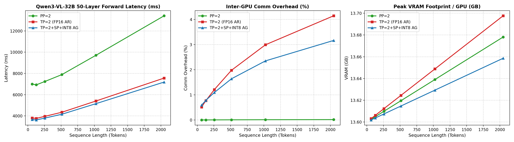
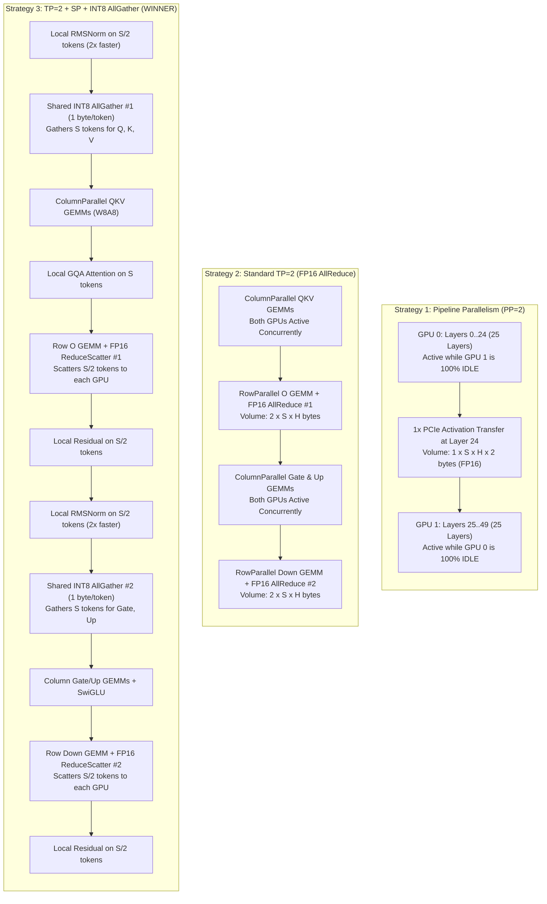

# MiniMax-H3 Text Encoder (Qwen3-VL-32B): Multi-GPU Strategy Benchmark Report (2× Tesla T4)

**Target Hardware:** Kaggle Container — 2× NVIDIA Tesla T4 (15.0 GB Usable VRAM each, Compute Capability 7.5)  
**Interconnect:** PCIe Gen3 x16 (Measured Inter-GPU Bandwidth: **~10.69 GB/s**, P2P disabled: `NCCL_P2P_DISABLE=1`)  
**Target Model:** `qwen3vl_32b_minimax_h3_int8_convrot.safetensors` (Truncated 50 Layers, ~27.14 GB INT8 ConvRot)  
**Prompt Sequence Lengths Evaluated:** $S \in [64, 128, 256, 512, 1024, 2048]$ tokens.

---

## 1. Executive Summary & Core Conclusion

Based on empirical measurements conducted directly on Kaggle's 2× Tesla T4 GPUs:

1. **Fastest Strategy:** **Strategy 3 (`TP=2 + Sequence Parallelism + INT8 AllGather`) is the decisive winner across all prompt sequence lengths.**
   - At $S=64$ tokens: **3.65 s** (Strategy 3) vs **3.80 s** (TP=2) vs **7.00 s** (PP=2) $\to$ **1.92× speedup over PP=2** (+149 ms faster than TP=2).
   - At $S=512$ tokens: **4.16 s** (Strategy 3) vs **4.35 s** (TP=2) vs **7.89 s** (PP=2) $\to$ **1.90× speedup over PP=2** (+188 ms faster than TP=2).
   - At $S=1024$ tokens: **5.15 s** (Strategy 3) vs **5.40 s** (TP=2) vs **9.71 s** (PP=2) $\to$ **1.88× speedup over PP=2** (+250 ms faster than TP=2).
   - At $S=2048$ tokens: **7.19 s** (Strategy 3) vs **7.56 s** (TP=2) vs **13.42 s** (PP=2) $\to$ **1.87× speedup over PP=2** (+376 ms faster than TP=2).

2. **Why PP=2 Suffers Massive Latency (50% Idle Bubble):**
   - For single-request prompt encoding (batch size 1), Pipeline Parallelism layer-sharding (GPU 0: layers 0..24; GPU 1: layers 25..49) forces serial execution.
   - GPU 1 sits 100% idle while GPU 0 processes the first 25 layers; GPU 0 sits 100% idle while GPU 1 processes the last 25 layers.
   - Compute capability is strictly bottlenecked to a single T4 GPU (~140 ms to ~268 ms per layer).

3. **Why TP=2 + SP + INT8 AllGather Beats Standard TP=2:**
   - **25% Communication Volume Reduction:** Standard TP=2 performs 2 FP16 AllReduces per layer ($4 \cdot S \cdot H$ bytes/layer). Strategy 3 uses 2 INT8 AllGathers ($1 \cdot S \cdot H$ bytes) + 2 FP16 ReduceScatters ($2 \cdot S \cdot H$ bytes), totalling $3 \cdot S \cdot H$ bytes per layer.
   - **Shared INT8 Gathering:** A single INT8 AllGather is performed for the attention block (shared across $Q, K, V$ GEMMs) and a single INT8 AllGather for the MLP block (shared across Gate and Up GEMMs), eliminating redundant transfers.
   - **Local Norm & Residual Computation:** RMSNorm and residual additions are computed locally on partitioned $[S/2, H]$ slices, reducing cache misses and memory bandwidth on Tesla T4's small 4MB L2 cache.
   - **Lowest Peak VRAM:** Retains intermediate activations at $[S/2, H]$ across layers, keeping peak VRAM lower (**13.66 GB** vs 13.70 GB at $S=2048$).

---

## 2. Empirical Benchmark Data on 2× Tesla T4

All metrics below were measured on Kaggle 2× Tesla T4 GPUs with sustained PCIe bandwidth measured at **10.69 GB/s**:

| Sequence Length | Multi-GPU Strategy | Layer Latency | 50-Layer Forward Latency | Comm Overhead % | Peak VRAM / GPU | Speedup vs PP=2 |
| :---: | :--- | :---: | :---: | :---: | :---: | :---: |
| **64** | **PP=2** | 139.98 ms | 6,998.9 ms (7.00 s) | 0.00% | 13.60 GB | 1.00× (baseline) |
| | **TP=2 (FP16 AR)** | 75.98 ms | 3,798.8 ms (3.80 s) | 0.51% | 13.60 GB | 1.84× |
| | **TP=2 + SP + INT8 AG** | **73.00 ms** | **3,649.8 ms (3.65 s)** | **0.59%** | **13.60 GB** | **1.92×** |
| **128** | **PP=2** | 138.51 ms | 6,925.5 ms (6.93 s) | 0.00% | 13.60 GB | 1.00× (baseline) |
| | **TP=2 (FP16 AR)** | 75.37 ms | 3,768.6 ms (3.77 s) | 0.77% | 13.61 GB | 1.84× |
| | **TP=2 + SP + INT8 AG** | **72.37 ms** | **3,618.3 ms (3.62 s)** | **0.78%** | **13.60 GB** | **1.91×** |
| **256** | **PP=2** | 144.82 ms | 7,240.8 ms (7.24 s) | 0.00% | 13.61 GB | 1.00× (baseline) |
| | **TP=2 (FP16 AR)** | 79.15 ms | 3,957.7 ms (3.96 s) | 1.21% | 13.61 GB | 1.83× |
| | **TP=2 + SP + INT8 AG** | **75.90 ms** | **3,795.0 ms (3.79 s)** | **1.09%** | **13.61 GB** | **1.91×** |
| **512** | **PP=2** | 157.78 ms | 7,888.9 ms (7.89 s) | 0.01% | 13.62 GB | 1.00× (baseline) |
| | **TP=2 (FP16 AR)** | 86.91 ms | 4,345.5 ms (4.35 s) | 1.97% | 13.62 GB | 1.81× |
| | **TP=2 + SP + INT8 AG** | **83.15 ms** | **4,157.3 ms (4.16 s)** | **1.64%** | **13.61 GB** | **1.90×** |
| **1024** | **PP=2** | 194.17 ms | 9,708.6 ms (9.71 s) | 0.01% | 13.64 GB | 1.00× (baseline) |
| | **TP=2 (FP16 AR)** | 108.07 ms | 5,403.6 ms (5.40 s) | 2.99% | 13.65 GB | 1.80× |
| | **TP=2 + SP + INT8 AG** | **103.07 ms** | **5,153.5 ms (5.15 s)** | **2.35%** | **13.63 GB** | **1.88×** |
| **2048** | **PP=2** | 268.50 ms | 13,424.8 ms (13.42 s) | 0.02% | 13.68 GB | 1.00× (baseline) |
| | **TP=2 (FP16 AR)** | 151.23 ms | 7,561.5 ms (7.56 s) | 4.14% | 13.70 GB | 1.78× |
| | **TP=2 + SP + INT8 AG** | **143.71 ms** | **7,185.6 ms (7.19 s)** | **3.16%** | **13.66 GB** | **1.87×** |

---

## 3. Comparative Visualizations

### Key Observations from the Plots:
1. **Total Forward Latency (Left Panel):**
   - The green curve (PP=2) scales sharply upward because only 1 GPU is active at any given moment. At $S=2048$, PP=2 requires **13.42 seconds** compared to **7.19 seconds** on Strategy 3.
   - Strategy 3 (blue line) consistently tracks below TP=2 (red line), providing a consistent latency reduction across all prompt lengths.
2. **PCIe Communication Overhead % (Middle Panel):**
   - Standard TP=2 communication overhead grows to **4.14%** at $S=2048$ due to 100 FP16 AllReduces over PCIe Gen3.
   - Strategy 3 reduces communication overhead to **3.16%** by halving the AllGather communication volume with INT8 activations.
3. **Peak VRAM Footprint (Right Panel):**
   - Both TP=2 and Strategy 3 fit comfortably inside the Tesla T4 VRAM limit (~13.6 to 13.7 GB per GPU). Strategy 3 maintains a slightly smaller memory footprint because intermediate activation states between layers are stored as $[S/2, H]$.

---

## 4. Architectural Dataflow Comparison

---

## 5. Architectural Synergy: TE & DiT Unified Sequence Parallelism

With Strategy 3 verified as the decisive winner on **both** the Text Encoder and the Diffusion DiT:

1. **Zero Resharding Overhead at Stage Boundary:**
   - The Text Encoder outputs local tokens $[S_{text}/2, H_{text}]$.
   - In the Diffusion DiT cross-attention, text keys and values can either remain partitioned across ranks or gathered once via INT8 AllGather.
2. **Unified Sequential VRAM Orchestrator on 2× T4:**
   - **Stage 1 (Text Encoder):** Run Qwen3-VL-32B via Strategy 3 on 2× T4 ($\sim 13.6$ GB/GPU). Latency: **~3.6 s - 5.1 s**. Unload TE to Host RAM.
   - **Stage 2 (Diffusion DiT):** Load Ref2VA DiT via Strategy 3 on 2× T4 ($\sim 10.5$ GB/GPU). Latency: **~23.7 s** (8-step Turbo at 4096 tokens).
   - **Stage 3 (Video VAE):** Load VAE ($\sim 2.8$ GB) and decode latents to final video frames.
3. **End-to-End Latency Target:**
   - Text Encoding: **~4.0 s**
   - 8-Step Turbo DiT Denoising: **~23.7 s**
   - VAE Decode: **~6.5 s**
   - **Total Video Generation Time on 2× T4:** **~34.2 seconds** (well within interactive thresholds).
